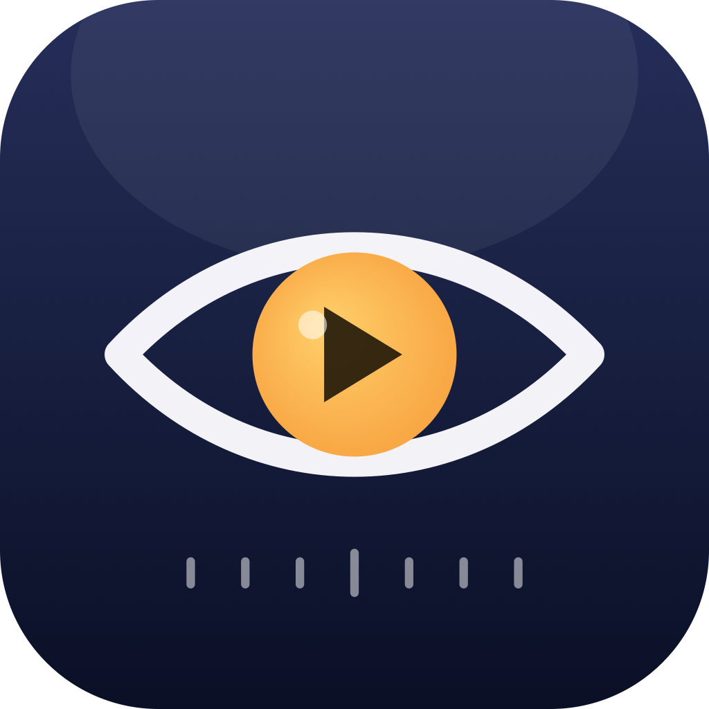
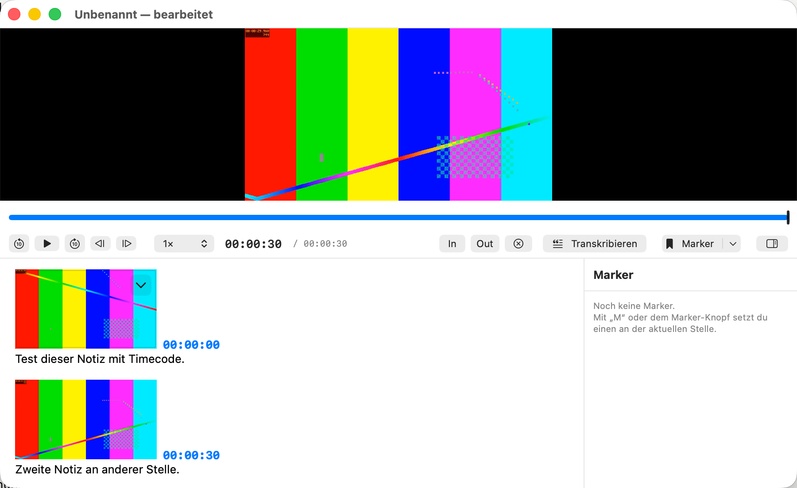
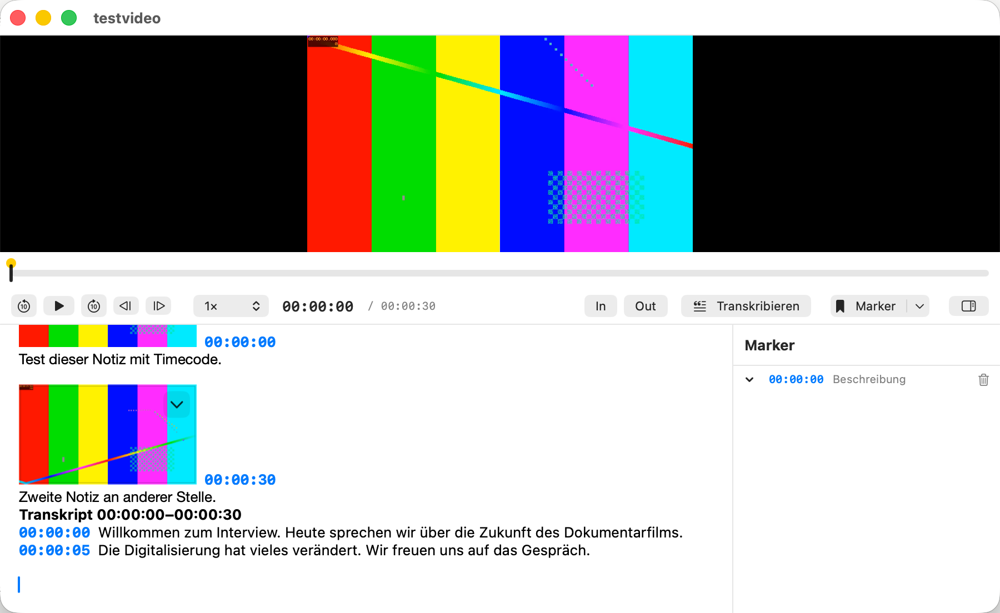
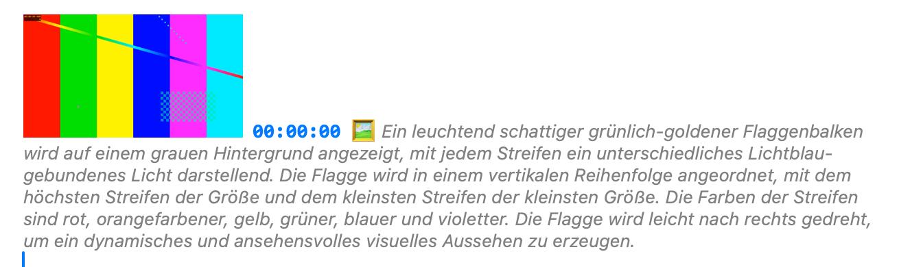

<p align="center">
  
</p>

<h1 align="center">Sighting</h1>

<p align="center">
  Eine native macOS-App zum Sichten von Videomaterial — mit automatischen Timecode-Notizen,<br>
  lokaler Whisper-Transkription und Export nach PDF, DOCX und CSV.
</p>

<p align="center">
  <a href="LICENSE"></a>
  
  
</p>

<p align="center">
  <a href="https://github.com/fmatsch/sighting/releases/latest">⇩ Neueste Version herunterladen</a>
  &nbsp;·&nbsp;
  <a href="https://fmatsch.github.io/sighting/">Projektseite</a>
</p>

---

## Worum geht's

Sighting ist für alle gedacht, die Videomaterial sichten und dabei strukturiert Notizen
machen müssen — Dokumentarfilmer:innen, Journalist:innen, Interview-Auswertung,
Rohmaterial-Sichtung im Schnitt. Das Layout ist bewusst einfach: oben das Video,
darunter die Notizen.

Der Clou: sobald man zu tippen beginnt, fügt die App automatisch den aktuellen
**Timecode** und ein kleines **Standbild** aus dem Video ein. Der Timecode ist klickbar
und springt im Video zur Stelle zurück — so entsteht nebenbei ein durchsuchbares,
visuelles Protokoll der Sichtung.

## Features

- **Zweigeteiltes Layout** — Video oben, Notizen unten, klassischer Sichtungs-Workflow
- **Automatischer Timecode + Screenshot** beim Beginn einer neuen Notiz — der Screenshot-Teil
  lässt sich per Schalter in der Werkzeugleiste oder im Menü „Sichten" jederzeit ein-/ausschalten
- **Klickbare Timecodes** — Klick im Text springt im Video an die Stelle
- **Profi-Steuerung** — 0,5×–2× Geschwindigkeit, Bild-für-Bild, Shortcuts (J/K/L, Leertaste, Pfeile)
- **Marker & Favoriten** — farbige Marker in der Timeline mit Übersichtsliste
- **In/Out-Bereichswahl** als Basis für Segment-Transkription
- **Lokale Transkription mit Whisper** (whisper.cpp, Modell `large-v3-turbo`) — läuft komplett offline
- **Projekte speichern/laden** als `.sighting`-Paket, mit Autosave
- **Export** als PDF, DOCX (inkl. Bilder & Timecodes) und CSV (Timecode-Liste)
- **MXF/XDCAM-Unterstützung** — Broadcast-Footage (z. B. XDCAM-MXF), das AVFoundation
  nicht direkt öffnen kann, wird beim Import automatisch und verlustfrei nach .mov
  umgepackt (kein Re-Encode, nur Container-Tausch via ffmpeg)
- **KI-Bildbeschreibung auf Deutsch (optionales Add-on)** — beschreibt Video-Standbilder
  lokal per [Ollama](https://ollama.com) + `moondream` und übersetzt sie automatisch mit
  einem zweiten kleinen Modell (`qwen2.5:1.5b`) ins Deutsche; ganz ohne installiertes
  Ollama bleibt der Rest der App unverändert nutzbar. Manuell per „Bild beschreiben“ oder
  als **Vollautomatik**, die bei jedem gesetzten Marker automatisch eine Beschreibung
  anlegt. Da zwei Modelle geladen werden, kann der erste Durchlauf je nach freiem
  Arbeitsspeicher einige Sekunden bis über eine Minute dauern

## Screenshots

<p align="center">
  
  
</p>
<p align="center">
  
</p>

## Voraussetzungen

- macOS 14 oder neuer (Apple Silicon empfohlen)
- [Xcode Command Line Tools](https://developer.apple.com/xcode/resources/) (`xcode-select --install`)
- [Homebrew](https://brew.sh)
- Für Transkription und MXF-Import: [`whisper-cpp`](https://github.com/ggml-org/whisper.cpp) und `ffmpeg`
- Optional, nur für die KI-Bildbeschreibung: [`ollama`](https://ollama.com)

```bash
brew install whisper-cpp ffmpeg

# optional, nur für die KI-Bildbeschreibung
brew install ollama
brew services start ollama
ollama pull moondream
ollama pull qwen2.5:1.5b
```

Das Whisper-Modell (`large-v3-turbo`, ca. 1,6 GB) lädt die App beim ersten
Transkriptionsversuch selbst herunter und legt es unter
`~/Library/Application Support/Sighting/models/` ab.

## Build & Start

```bash
git clone https://github.com/fmatsch/sighting.git
cd sighting
./build-app.sh
open Sighting.app
```

Das Skript baut das Swift-Package (`swift build -c release`) und packt daraus
`Sighting.app`. Ein Xcode-Projekt wird nicht benötigt — Swift Package Manager reicht.

> **Hinweis:** Der gebaute App ist ad-hoc signiert (kein Developer-ID-Zertifikat).
> Für den eigenen Rechner ist das kein Problem; zum Weitergeben an andere müsste
> die App notarisiert werden.

## Projektstruktur

| Pfad | Inhalt |
|---|---|
| `Sources/Sighting/PlayerController.swift` | AVPlayer-Steuerung, Timecodes, In/Out |
| `Sources/Sighting/PlayerView.swift` | Video-Ansicht & Steuerleiste |
| `Sources/Sighting/TimelineView.swift` | Zeitleiste, Marker, Markerliste |
| `Sources/Sighting/NotesEditor.swift` | Notizfeld mit Auto-Timecode/Screenshot |
| `Sources/Sighting/WhisperService.swift` | Lokale Transkription via whisper.cpp |
| `Sources/Sighting/ExportService.swift` / `DocxWriter.swift` | PDF-, DOCX-, CSV-Export |
| `Sources/Sighting/ProjectStore.swift` | Projekt speichern/laden (`.sighting`-Paket) |

## Lizenz

[MIT](LICENSE) — © 2026 Florian Matscheko
